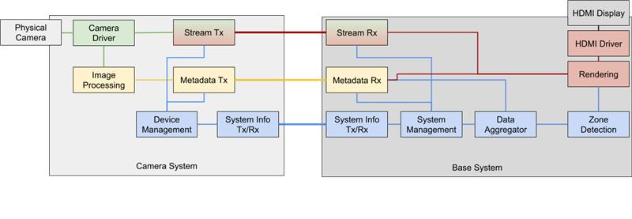

# HDMI

## Project Description

We will build a security system which will detect if any person is within a restricted area within a room.
The overall system will consist of one base station and two or more camera systems. Each camera system will
interface with a camera that is monitoring a room from different angles, use a computer vision library/algorithm
to detect and generate bounding boxes for people in the room, and send all this information to the base system.
The base system will aggregate all this data, make a decision on whether there are any people in the forbidden area,
and additionally display all video feeds and bounding boxes via HDMI.

## Diagram

## HDMI Team

### Responsibilities

- Receive video stream via RTSP/UDP
- Receive bounding box data
- Render bounding boxes and camera streams on HDMI

### Members

*Sub team: Rendering*  
David Boullie (leader) - focused on GUI layout design and placement of various elements on display. Additionally, supporting switching to different views.

Sam Lambrecht - focused on displaying frames from camera stream.

Matt Downing - focused on bounding box drawing and text drawing. Text includes alerts and camera status.

*Sub team: HDMI Driver*  
Joseph Berman

Tom Doyle

*Sub team: Stream Tx/Rx*  

Connor Northway
