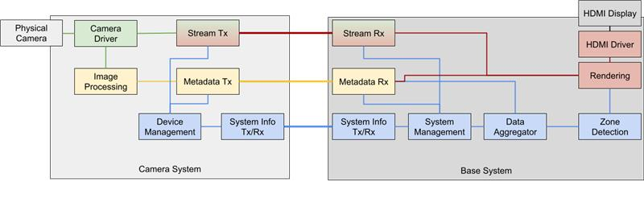

# Security System

## Project Description

We will build a security system which will detect if any person is within a restricted area within a room.
The overall system will consist of one base station and two or more camera systems. Each camera system will
interface with a camera that is monitoring a room from different angles, use a computer vision library/algorithm
to detect and generate bounding boxes for people in the room, and send all this information to the base system.
The base system will aggregate all this data, make a decision on whether there are any people in the forbidden area,
and additionally display all video feeds and bounding boxes via HDMI.

## High-level 'What'
(notes from class 3/11)

- self discovering camera modules
- user determine security zone
- live feed toggleable
  - feed auto toggle
- bounding box for subject
  - max number of subjects?? 10?
- what are we detecting? people? objects?
- HDMI shows text of which camera/camera status, FPS, shapes, RTSP stream
- 

## Diagram

## Project Organization

This is the main repo for the entire project. Each team has its own branch:
- camera/master
- cv/master
- sysman/master
- hdmi/master
Each team can make additional branches as necessary for each feature, e.g. camera/stream_tx. As we work on the project,
we will make pull requests into the main team branch. For full integration, all team main branches will be merged into
the main project branch.

## Camera Team

### Responsibilities

- Connect to camera, retrieve images
- Expose interface to CV team to provide current image via IPC
- Send image data to base station via RTSP/UDP

### Members
Ben Palmer (leader)

Emma Brodigan

Muhammad Elarbi

## Computer Vision Team

### Responsibilities

- Retrieve images from camera driver via IPC
- Process images, detect humans using CV and generate coordinates for boxes around them
- Transmit coordinates of all bounding boxes to base station via TCP

### Members
John Privitera (leader)

Jack Horton

Nicole Johnson

## System Management Team

### Responsibilities

- Overall system info
  - connection between systems: acknowleging and enumerating the camera modules
  - informing each camera module's TX component of any potential instance-specific network config info.
- Aggregate all bounding box data from all camera systems and make decision on if someone is in the restricted area -> send alert to display subsystem

### Members
John Craffey (leader)

Sid Chenrayan

Joshua Erickson

Samir Elhelw

## HDMI Team

### Responsibilities

- Receive video stream via RTSP/UDP
- Receive bounding box data
- Render bounding boxes and camera streams on HDMI

### Members
David Boullie (leader)

